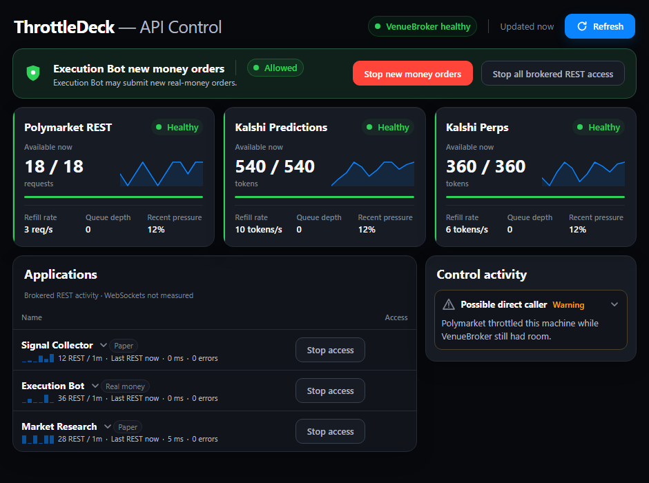

# ThrottleDeck

[](LICENSE)

ThrottleDeck pairs a loopback-only request broker with a compact Windows control
window. One process owns the venue request budgets for this machine. Every
bot calls it, so independent process limiters cannot collectively breach a
per-IP ceiling.

The service only accepts `GET`. It maps public `/pmus/<path>` reads to
`https://gateway.polymarket.us/<path>`. Retail `/v1/account`, `/v1/portfolio`,
and `/v1/orders` reads use `https://api.polymarket.us/<path>`.
It maps `/kalshi/<path>` to
`https://external-api.kalshi.com/trade-api/v2/<path>`. Query strings and caller
authentication headers pass through unchanged. The service has no direct-order
fallback and no write route.

This deliberately occupies a smaller niche than a general API gateway. See
[related projects and design choices](docs/ALTERNATIVES.md) for the public
comparison that informed the implementation.

## First run on Windows

Run this from an **elevated** PowerShell window; it may be called from inside or
outside the checkout:

```powershell
powershell -ExecutionPolicy Bypass -File .\scripts\setup-throttledeck.ps1
```

The setup checks Windows, Python 3.12, Microsoft Edge, administrator rights, and
the two local ports before changing anything. It creates `.venv` when needed,
installs only the runtime dependencies, registers the one broker task, creates a
desktop shortcut, starts the compact control window hidden, and waits for both
local health endpoints. It can be run again: an existing
`%LOCALAPPDATA%\ThrottleDeck\apps.toml` is left untouched.

The initial rate policy is conservative: Kalshi prediction reads use the Basic
tier and perps reads remain off until an operator explicitly configures their
documented rate. Setup does not request, save, display, or configure any
exchange account material. Configure callers afterwards in the per-user file as
described in [Configure applications per user](#configure-applications-per-user).
Append `-PreflightOnly` to the command to run those checks without changing the
machine.

## How a read travels

```
                     Any configured local application
                                  |
                                  v
                    +---------------------------+
                    |  GET + X-Broker-Caller    |
                    +---------------------------+
                                  |
                                  v
                    +---------------------------+
                    | ThrottleDeck Broker :8777 |
                    | loopback, GET only        |
                    +---------------------------+
                                  |
                                  v
                    +---------------------------+          +------------------+
                    |  Response cache           | - hit -> |  served, no call |
                    +---------------------------+          +------------------+
                                  | miss
                                  v
                    +---------------------------+          +------------------+
                    |  Single-flight            | - dup -> |  share one call  |
                    +---------------------------+          +------------------+
                                  |
                                  v
                    +---------------------------+
                    |  Weighted queue           |
                    |  trading 8 | std 2 | bulk 1|
                    +---------------------------+
                                  |
                                  v
                    +---------------------------+
                    |  ONE bucket per venue     |
                    |  shared by every caller   |
                    +---------------------------+
                                  |
                                  v
                    +---------------------------+
                    |  The venue                |
                    +---------------------------+
                                  |
                                  v
                    +---------------------------+
                    |  429?                     |
                    +---------------------------+
                       |                    |
                      no                   yes
                       |                    |
                       v                    v
              +----------------+   +---------------------------+
              |  Return it     |   |  Latency stopgap?         |
              +----------------+   +---------------------------+
                                      |                    |
                                     yes                   no
                                      |                    |
                                      v                    v
                            +----------------+   +---------------------------+
                            |  Count apart,  |   |  Did WE have headroom?    |
                            |  do not back   |   +---------------------------+
                            |  off           |      |                    |
                            +----------------+     yes                   no
                                                    |                    |
                                                    v                    v
                                          +------------------+  +------------------+
                                          |  LOG IT: someone |  |  Our own traffic |
                                          |  outside the     |  |  hit the ceiling |
                                          |  broker is       |  +------------------+
                                          |  calling         |
                                          +------------------+
```

Two rules the diagram deliberately has no room for:

- **Writes never enter it.** The broker answers `GET` and refuses everything else
  with 405, so an order cannot queue behind a bulk sweep, be retried by something
  that cannot know whether it already filled, or be served from a cache. Point
  order placement straight at the venue.
- **There is no fallback.** If the broker is down a caller raises rather than
  calling the venue directly. A silent failover rebuilds the shared-IP breach
  this service exists to prevent.

## Documented limits and broker settings

The policy lives beside the implementation in
[`venue_broker/config.py`](venue_broker/config.py).

| Venue | Vendored source | Documented budget | Broker setting after the 0.90 margin |
|---|---|---:|---:|
| Polymarket US reads | [official rate limits](https://docs.polymarket.us/api-reference/rate-limits) | 20 requests/second per IP (public), per key (authenticated) | 18/second refill, 18 capacity, at most **18** in any rolling second |
| Kalshi reads (Advanced) | [official rate limits](https://docs.kalshi.com/getting_started/rate_limits) | 300 tokens/second, 600-token capacity | 270 tokens/second, 540-token capacity when selected |
| Kalshi reads (Basic — the code default) | [official rate limits](https://docs.kalshi.com/getting_started/rate_limits) | 200 tokens/second, 400-token capacity | 180 tokens/second, 360-token capacity |

Every row applies the `VENUE_BROKER_RATE_MARGIN=0.90` safety margin. Kalshi
uses tokens, not request counts: most requests cost 10 tokens, while the CF
Benchmarks passthrough costs 50. Margin balance costs 5 tokens, or 50 when its
expensive available-balance calculation is requested. That is why the documented
Basic 200-token budget sustains only 4 of those requests
per second.

The code and public launcher default to the conservative Basic tier so a fresh
checkout cannot over-request on an account that has not been upgraded. Set
`VENUE_BROKER_KALSHI_TIER` in the service environment only after checking the
account's authenticated limits response. `/metrics` reports the tier actually in
force, which is the only runtime value worth trusting.

Set `VENUE_BROKER_KALSHI_TIER` to `advanced`, `expert`, `premier`, `paragon`,
`prime`, or `prestige` only after checking the authenticated account's
`GET /account/limits` response.

Polymarket public and authenticated reads conservatively share one budget. The
rolling ceiling also applies to retries and programmatic bucket overrides. The
initial burst remains available; once **18** requests have been admitted within
a rolling second, further work waits until the oldest admission leaves that
window, even if tokens have refilled.

The ceiling is 18 rather than the venue's documented 20 because the margin
applies to it as well as to the refill rate. Our second is not the venue's
second, and sitting exactly on the limit turns a few milliseconds of clock
offset into a 429 while the broker believes it is compliant. Measured worst
rolling second: 18.

Kalshi has no rolling-window overlay: Basic and Advanced retain their documented
two-second Read capacities.

Kalshi batch orderbooks and batch candlesticks cost 10 tokens per supplied ticker.
The entire cost must fit before admission. Oversized reads get a local 400 with
`request_cost_exceeds_capacity`; split the batch instead of retrying unchanged.
At Advanced, **54 tickers** fit in a full 540-token bucket; on Basic it is 36 in
360. Missing,
empty, or more than 100 tickers get `invalid_request_cost`. No write batch is accepted.

Perps reads use a separate weighted limiter and a one-second token capacity.
Set `VENUE_BROKER_KALSHI_PERPS_READ_RATE` to the account's documented perps Read
refill rate from `/account/limits/perps`; the normal safety margin is then applied.
The broker does not infer the perps tier from the prediction tier or store account
credentials to discover it. Until configured, `/margin/...`, `/portfolio/margin/...`,
and `/account/limits/perps` return a local 503, `perps_budget_unconfigured`, without
consuming prediction tokens. An account owner must supply this rate separately.

Polymarket US has one deceptive error string: `Global Rate Limit Exceeded` is a
five-second order-latency stopgap, not a rate limit. The broker returns it without
backoff. A real HTTP 429 carrying `Too Many Requests` is counted and retried.

## Caller fairness policy

[`caller-policy.toml`](caller-policy.toml) is the only place that assigns callers
to scheduling classes. It is loaded once at startup, and an invalid file stops
startup with a clear error. An unconfigured caller immediately works as the
`standard` class. Changing a caller's class, including promoting a scanning bot
before it starts trading, requires only a TOML edit and broker restart; no project
name or class is hardcoded in the scheduler.

```toml
[defaults]
class = "standard"

[classes.trading]
weight = 8
[classes.standard]
weight = 2
[classes.bulk]
weight = 1

[callers.execution-bot]
class = "trading"
[callers.research-worker]
class = "bulk"
```

A weight is a relative admission-turn share while classes are simultaneously
backlogged. With the default 8:2:1 weights, trading receives about `8 / 11` of
equal-cost turns, standard receives `2 / 11`, and bulk receives `1 / 11`.
Therefore trading gets roughly four times standard throughput (`8 / 2`) and
eight times bulk throughput (`8 / 1`) under contention. Idle classes do not
waste or bank turns. Within a class, active callers take round-robin turns.

These are scheduling weights, not separately reserved venue quotas. All classes
still spend one physical venue bucket. A burst that finishes before another
caller arrives can use currently available tokens, and one request already
selected for admission is not preempted. Once callers are queued together, a
positive-weight class cannot starve: with the shipped three classes, each
backlogged class receives a turn within at most 11 admission decisions. For the
usual equal-cost reads, weights govern admission turns rather than a hard latency
deadline. Polymarket's rolling ceiling can add a wait after a burst, and a costly
Kalshi read can wait for more tokens. The earlier `11 / 18 = 0.61` second estimate
was not a worst-case latency guarantee.

To add a bot, give it a valid `X-Broker-Caller` value. It works as `standard`
immediately. Add this only when a different policy is wanted:

```toml
[callers.my-new-bot]
class = "bulk"
```

Class and caller names may contain letters, numbers, underscores, periods, and
hyphens, up to 64 characters. Weights must be positive integers. Every referenced
class must exist. Unknown fields, malformed TOML, a missing policy file, invalid
weights, and missing class references all fail startup rather than silently
changing policy.

## Cache policy

Unknown paths are never cached. The explicit first-match table is in
`CACHE_TTL_RULES`:

| Data | TTL | Reason |
|---|---:|---|
| Polymarket books and best bid/offer | 0.25 seconds | Only collapse nearly simultaneous polling |
| Polymarket price history | 30 seconds | The endpoint's documented minimum cache interval |
| Kalshi order books | 0.25 seconds | Same; these are trade-sensitive prices |
| Polymarket sports/team/tag/reference directories | 5 minutes | Reference metadata |
| Kalshi series | 5 minutes | Reference metadata |
| Kalshi exchange status | 2 seconds | Avoid stale open/closed state |

Single-flight applies even when a path has a zero-second TTL: concurrent calls
for the exact same URL share one upstream request. Authenticated cache and
single-flight entries are isolated by an HMAC-SHA256 fingerprint of all supplied
authentication headers, using a random in-memory key unique to the broker instance.
Raw credentials never appear in cache keys or metrics. Caller names control
scheduling and reporting, not identity. Signatures and timestamps are included:
new signatures safely miss the cache even when the key ID is unchanged. Requests
without a valid caller name retain their conservative authenticated cache and
single-flight bypass. The HTTP client does not store or replay upstream cookies;
cookies explicitly supplied by a caller still pass through. The cache is bounded to
4,096 entries by default; `VENUE_BROKER_MAX_CACHE_ENTRIES` can change that cap.

## Failure contract

Every response copied from a venue keeps the venue's status and body and adds
`X-Venue-Broker-Source: venue`, including 4xx and 5xx responses. Failures created
by this service use structured JSON and
`X-Venue-Broker-Source: broker`:

| Condition | Status | Error code | Caller behavior |
|---|---:|---|---|
| Upstream exceeded `VENUE_BROKER_REQUEST_TIMEOUT_SECONDS` | 504 | `upstream_timeout` | Venue did not answer in time; retry according to the bot's policy |
| Upstream connection failed | 502 | `upstream_connection_failed` | Venue could not be reached through a healthy broker |
| Broker is closing | 503 | `broker_closing` | Wait for the local broker to become healthy; do not bypass it |
| Read cost exceeds full bucket capacity | 400 | `request_cost_exceeds_capacity` | Split the read batch; waiting cannot make it fit |
| Invalid read batch parameters | 400 | `invalid_request_cost` | Correct the ticker list |
| Perps budget not configured | 503 | `perps_budget_unconfigured` | Configure the separate account rate |
| Local broker connection drops or cannot be opened | Client exception | `BrokerUnavailableError` | Restart or wait for the broker; no direct fallback or transparent replay occurs |

The copied client waits 35 seconds by default, five seconds longer than the
broker's default upstream timeout, so the structured 504 has time to arrive. If
`VENUE_BROKER_REQUEST_TIMEOUT_SECONDS` is increased, callers must set their
client timeout higher than that broker value for the same guarantee.

A caller disconnect cancels only its broker waiter and no response is written to
the dead connection. If it was the leader of a shared single-flight request, the
upstream task is shielded so another coalesced caller is not broken; that one
upstream request may finish even when no caller remains.

`Retry-After` accepts numeric seconds and HTTP dates, as specified by
[HTTP semantics](https://www.rfc-editor.org/rfc/rfc9110.html#name-retry-after).
Past dates become zero delay; invalid or non-finite values use exponential backoff.

## Install and run

```powershell
py -3.12 -m venv .venv
.\.venv\Scripts\python.exe -m pip install -e ".[dev]"
.\.venv\Scripts\throttledeck-broker.exe
```

The host is hardcoded to `127.0.0.1`; only the port can be changed with
`VENUE_BROKER_PORT` (default `8777`). Uvicorn access logs are disabled so auth
headers cannot appear in them. `GET http://127.0.0.1:8777/metrics` reports the
bucket balance and aggregate/per-caller use. Per-caller fields include the
resolved class, current queue depth, admissions, and total/maximum/average queue
wait seconds. Per-class fields include weight and current queue depth.
Snapshots do not wait for the token-admission lock. Kalshi also reports a
separate `perps` balance and queue snapshot when configured; aggregate Kalshi
caller counts include both products. Polymarket reports `rolling_second_limit`.

`GET http://127.0.0.1:8777/health` is a cheap local liveness check and never calls
either venue. It returns `200 {"status":"ok"}` while accepting work and 503 with
`{"status":"closing"}` after shutdown begins. An upstream outage does not make
the broker unhealthy and should not cause a supervisor restart loop.

## ThrottleDeck dashboard

ThrottleDeck is the per-user control window for brokered access. It binds its own
hardcoded loopback address on port `8778`, separate from the broker on `8777`,
and it is not a second broker: it reads `GET /api/v1/snapshot` and posts the
explicit control actions that stop brokered REST access or the configured new-order
lock. It never starts, stops, or restarts the shared ThrottleDeck Broker task, and it
never becomes a second supervised instance. Controls never update optimistically:
a stop button keeps its prior state until the service returns the new revision,
and a revision conflict reloads the authoritative snapshot.

The standalone window opens at a compact 940 by 700 pixels and remains freely
resizable. Its cool near-black interface keeps the configured money stop, venue
budgets, application access, and control activity readable without a full-screen
dashboard. The normal startup view fits without a page scrollbar. Each compact
application row shows the actual brokered-REST request count and measurement
window, the last brokered-REST request age, and a sparkline built from adjacent
broker counter deltas. Unknown/reset intervals remain chart gaps rather than fake
zeroes. The screen explicitly says WebSockets are not measured; it never turns
REST silence into a claim that an application or direct stream is idle. Control
activity starts as one expandable priority row.

Expanding an application shows the recent split by venue, including its measured
upstream 429 count, 429s observed while the broker still had headroom, and worst
broker queue wait. A headroom 429 is a diagnostic signal, not proof that a
particular process bypassed the broker. The **Traffic audit** button is a manual
Windows-only sample of currently established HTTPS connections to the supported
venues. It shows only process name, PID, venue, and observation count; it never
collects command lines or request material. A clear result is also not proof:
short-lived connections can finish between samples.
Both polling hops use a one-miss grace period. One transient miss keeps the last
fresh sample without flashing an outage; two consecutive misses surface the
warning.

History keeps five-second detail for 6 hours and one-minute rollups for 90 days.
The 250 MB guard pauses sample writes but never control writes. If the guard is
reached, the next eligible maintenance pass rolls old detail up, performs a
one-time database compaction, checkpoints the journal, and resumes collection
when measured storage is back under the cap.



### Configure applications per user

Application identities are not compiled into ThrottleDeck. The first shortcut
installation copies the neutral template
[`governor/default-apps.toml`](governor/default-apps.toml) to
`%LOCALAPPDATA%\ThrottleDeck\apps.toml`. Edit that per-user file to define each
application's display name, stable app ID, broker caller labels, paper/real-money
badge, coverage note, and the one application protected by the new-order gate.
The local file is outside the repository and must not contain API credentials.

```toml
[[apps]]
id = "execution"
name = "Execution Bot"
callers = ["execution-bot", "execution-monitor"]
money_mode = "real"
coverage_note = "Brokered REST is measured; order submission is separate."

[money_control]
app_id = "execution"
confirmation_phrase = "UNLOCK NEW ORDERS"
```

Caller labels must be unique across applications. Restart ThrottleDeck and
ThrottleDeck Broker after changing the file so the dashboard registry and broker access
policy load the same mapping. Existing stop states are preserved; a newly added
application starts allowed. The screenshot above is generated from synthetic
fixtures, so a public checkout does not expose an operator's bot names or usage.

### Build the dashboard

The React 19 sources live in `ui/` and the production bundle is served by the
control service out of `governor/static/`.

```powershell
npm --prefix ui install
npm --prefix ui test
npm --prefix ui run typecheck
npm --prefix ui run build
npm --prefix ui run test:e2e
```

`npm run build` writes the bundle into `governor/static/`, which is committed so
the service ships a working window without a Node toolchain. `npm run test:e2e`
builds the bundle, serves it on `127.0.0.1:4173`, and drives it at 940 by 700,
the approximately 920 by 650 usable area inside that Windows app frame, and 720
by 480 with every API call intercepted; it needs local Playwright browser binaries
and never calls a venue.

### Run it hidden with a desktop shortcut

```powershell
powershell -ExecutionPolicy Bypass -File scripts/install-governor-shortcut.ps1
```

That creates one per-user shortcut named `ThrottleDeck`. It targets
`wscript.exe` running `scripts/start-governor-hidden.vbs`, which starts
`scripts/start-governor-hidden.ps1` with a hidden window. The launcher starts
`python -m governor` only when `http://127.0.0.1:8778/health` is absent, waits up
to 25 seconds for that health check, redirects service output to
`logs/governor.out.log` and `logs/governor.err.log`, then opens the installed
Microsoft Edge in `--app` mode with a one-use launch nonce. The per-install
control key stays in `%LOCALAPPDATA%\ThrottleDeck\control.key` and is only sent in
memory, never on a command line and never in a log. No console window is shown,
no scheduled task is registered, and the existing ThrottleDeck Broker task is untouched.
Edge receives `--window-size=940,700` so each shortcut launch starts as a compact
utility window rather than occupying most of the screen.

## Adopt from another repository

```python
from broker_client import get
response = get("/v1/events", venue="pmus", caller="my-bot")
data = response.raise_for_status().json()
```

Copy `broker_client.py` into the repository and install `httpx`. If the service
is unavailable, the client raises `BrokerUnavailableError` with the start command;
it never calls a venue directly.

### Before a bot depends on this

Install the scheduled task first. The client has no fallback by design, so a bot
pointed here when the broker is not running simply stops:

```powershell
powershell -ExecutionPolicy Bypass -File scripts\install-broker-task.ps1
```

It needs one elevated run because S4U — "run whether the user is logged on or
not" — grants a batch logon right. Nothing else here needs elevation.

### Reads come here. Writes do not.

The broker answers `GET` and refuses everything else with `405`. That is
deliberate: an order must not be queued behind a bulk sweep, retried by
something that cannot know whether it already filled, or served from a cache.
Point a bot's reads at the broker and leave its order placement pointed
directly at the venue.

### Name the caller

Send `X-Broker-Caller` on every request. An unnamed caller still works, counted
as `unknown` at the `standard` weight, but it cannot be given the `trading`
share and cannot be told apart in `/metrics`. Use one name per process rather
than one per project — a scanner and a trade stream in the same bot compete for
the same budget and are worth seeing separately.

### An SDK that signs its own requests

Clients that build signed headers themselves work unchanged: sign the venue's
path as usual and send the request to the broker, which forwards it. The
polymarket-us SDK takes base-URL overrides, and the same broker path serves
both of its hosts because the upstream is chosen from the request path:

```python
AsyncPolymarketUS(
    key_id=..., secret_key=...,
    gateway_base_url="http://127.0.0.1:8777/pmus",
    api_base_url="http://127.0.0.1:8777/pmus",
)
```

Verified on 2026-09-13: an authenticated balance read returns the same result
through the broker as directly against the venue.

## Verify

```powershell
.\.venv\Scripts\pytest.exe -q
.\.venv\Scripts\ruff.exe check .
```

The default suite injects the upstream fetch function and makes no network calls.
It automatically excludes tests marked `integration`. Deliberately check the two
live, public read contracts with:

```powershell
.\.venv\Scripts\pytest.exe -q -m integration
```

The live tests make one Polymarket US events request and one Kalshi exchange-status
request through an in-process broker. They are contract checks, not a load test,
and need internet access. They do not start or bind the broker service.

To prove the review regression tests fail when their fixes are removed, run:

```powershell
python scripts/prove_review_regressions.py
```

This uses a disposable copy inside this checkout, removes each fix separately,
requires a test failure, restores the fix, and requires a passing run. It never
changes this checkout's implementation, calls a venue, or touches the running
service.
